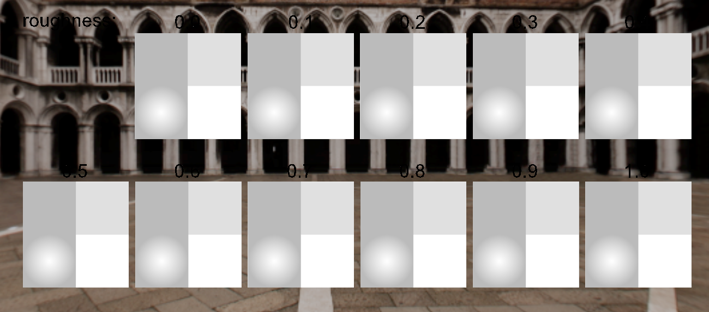
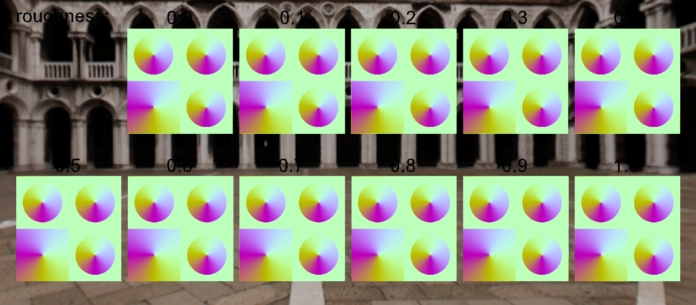

# anisotropinator

Simple utility created for us to evaluate encoding anisotropy texture data in 2 channels, with xy representing a 2D vector and strength encoded as the magnitude of the vector.

> **Warning**
> There appears to be a bug in either my rendering of anisotropy, or this conversion tool itself based on the results shown below. This is a live document.

# Comparisons

Below is the sample model to test anisotropy with varied roughness, as well as a gradient test to assess any information loss in the conversion process due to quantization (using less bits to represent strength and direction).


*AnisotropyGradientsRoughness Model created by @ericchadwick, rendered in Babylon.js*

## "Default" Anisotropy Representation


*Input format: Red,Green channels specify a 2D direction, Blue channel defines anisotropy strength with values ranging from 0 (no anisotropy) to 1 (full anisotropy).*

## 2 Channel Anisotropy Representation


*2D format: anistropy is encoded as a 2D direction, with the magnitude indicating the strength.*

## Roundtrip 2 Channel back into 3 Channel


*2channel anistropy transformed back into the "default" 3 channel representation.*

## Roundtrip 2 Channel into Angular Direction


*2 channel anistropy (2D direciton with magnitude representing strength) transformed into a 2 channel angle, strength representation.*

# Renderings

The following are preliminary renderings in my own renderer to test out the 3 channel vs 2 channel representation.

|                      3 channel                       |                   2 channel                    |
| :--------------------------------------------------: | :--------------------------------------------: |
|           |           |
|  |  |

## AnisotropyGradientRoughness Breakdown

|    Output     |                      3 channel                       |                   2 channel                    |
| :-----------: | :--------------------------------------------------: | :--------------------------------------------: |
|    normals    |           |           |
|     dirx      |  |  |
|     diry      |  |  |
|      str      |  |  |
| anisotropicT  |  |  |
| specular_brdf |  |  |

# Implementation

Decoding the 2 channel anisotropy goes as follows:

```GLSL
    vec2 anisotropySample = texture(u_AnisotropyTexture, texCoords).rg;
    vec3 direction = vec3(anisotropySample.rg * 2.0 - vec2(1.0), 0.0);
    if (dot(direction, direction) == 0.0)
    {
        direction.rg = pbrInputs.anisotropy.rg;
    }
    float anisotropyStrength = length(direction.rg);
    direction = normalize(direction);
    anisotropy = clamp(anisotropyStrength * pbrInputs.anisotropy.b, 0.0, 1.0);
    anisotropicT = normalize(getTBN() * direction);
    vec3 anisotropicB = normalize(cross(n, anisotropicT));
    specularBrdf = specular_brdf_anisotropic(alphaRoughness, anisotropy, n, v, l, h, anisotropicT, anisotropicB);
```
